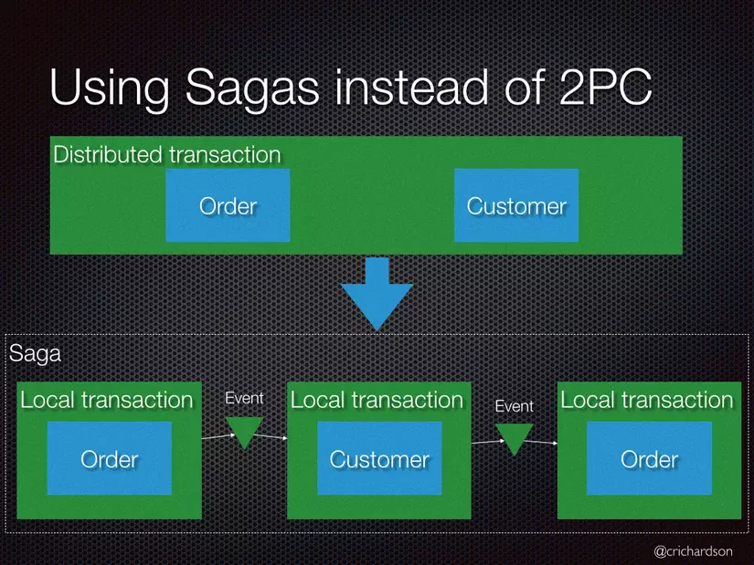
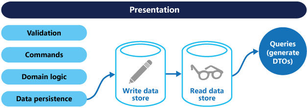

# Getting Started

### Reference Documentation
For further reference, please consider the following sections:
* [The Clean Architecture](https://blog.cleancoder.com/uncle-bob/2012/08/13/the-clean-architecture.html)
* [Official Apache Maven documentation](https://maven.apache.org/guides/index.html)
* [Spring Boot Maven Plugin Reference Guide](https://docs.spring.io/spring-boot/docs/2.7.2/maven-plugin/reference/html/)
* [Create an OCI image](https://docs.spring.io/spring-boot/docs/2.7.2/maven-plugin/reference/html/#build-image)
* [Spring Data JPA](https://docs.spring.io/spring-boot/docs/2.7.2/reference/htmlsingle/#data.sql.jpa-and-spring-data)
* [H2 Database](https://www.h2database.com/html/tutorial.html)
* [Spring Actuator](https://www.h2database.com/html/tutorial.html)

### Overviews
* REST API development by Clean Architecture


For demonstrate we have implemented :
1. Registration User following the requirement
2. Use Actuator : this library is that we get health and monitoring metrics from production-ready applications. Moreover, the gathering of metrics, understanding traffic, or knowing the state of the database, becomes tremendously easy with Actuator.
   
    Can access into http://localhost:8080/actuator (list all endpoint)
    

We're using H2 database all data will save on file on directory [your current working folder]/data

The project include three layer
1. Domain -> This is Enterprise Business Rule layer  includes : entity , constants, enums, exception , port(repository interface)
   - Represent your domain object
   - Apply only logic that is applicable in general to the whole entity (e.g. validating the format of an hostname)
   - Plain java objects: no frameworks, no annotations
2. Usecase >> This is Application Business Rule layer 

   - Represent your business actions, it’s what you can do with the application. Expect one use case for each business action
   - Pure business logic, plain java (expect maybe some utils libraries like StringUtils)
   - Define interfaces for the data that they need in order to apply some logic. One or more dataproviders will implement the interface, but the use case doesn’t know where the data is coming from
   - The use case doesn't know who triggered it and how the results are going to be presented (e.g. could be on a web page, or returned as json, or simply logged, etc.)
   - Throws business exceptions
3. Executable >> This is Interfaces Adapters layer include : controller , config , application

   - Are ways to interact with the application, and typically involve a delivery mechanism (e.g. REST APIs, scheduled jobs, GUI, other systems)
   - Trigger a use case and convert the result to the appropriate format for the delivery mechanism
   - A GUI would use MVC (or MVP) in here; the controller would trigger a use case

* Design pattern and frameworks

Spring boot web is main framework on this project.

Dependency Injection is a fundamental aspect of the Spring framework, through which the Spring container “injects” objects into other objects or “dependencies”.
Simply put, this allows for loose coupling of components (controller, service, repository layer ...)

This helps us to easy to replace new component without affect to other code and easy for write unit test.

On usecase layer, we have abstraction by using interface repository not using implement class.
It helps we can change logic on feature ( by write another implement class ) that not affect to other code.
* Data and error handling

Data organized on model and dto

1. entity package is all entity class mapping with table columns 

2. dto package is all POJO class mapping for request and response

The response return to user have standardized with ResponseEntity object with construct

````
{
    "code": "1",
    "status": "PASSED",
    "description": "User create Successfully",
    "data": {
        "id": 1,
        "email": "anh.nguyen3@sotatek.com",
        "password": "$2a$10$BlxvIsuqb.FyCB5Upz8pcuLUa8IGEBGDltAmzGnWqSEAVxaE3X54y",
        "salary": 30001.0,
        "memberType": "GOLD"
    }
}
````

Then all exception will handler on GlobalExceptionHandler Class  
All error declared in ResponseCode file with format as the bellow:

````
{
    "code": "MAI001",
    "description": [
        "The salary minimum is 15000 THB/month."
    ],
    "status": "FAILED"
}
````

* Scalability and  Microservice
1. Microservice: Spring Boot’s embedded Apache Tomcat server is acting as a webserver. Our app can be packages to self-contained, ready to run applications.

With common microservice system we can have these parts
  + API gateway 
  + Service discovery
  + Those microservices


A sample spring cloud microservice system


Spring cloud support all that features.
[Ref Spring Cloud Document](https://spring.io/microservices)

2.To perform transactions on multiple services we can use the Saga pattern.



Please refer  :
[Saga pattern](https://www.baeldung.com/cs/saga-pattern-microservices) (https://www.baeldung.com/cs/saga-pattern-microservices)

3.To perform query on multiple services we can use: API Composition or Command Query Responsibility Segregation (CQRS)


Please refer :
[ CQRS](https://www.baeldung.com/cqrs-event-sourcing-java)

4.Scalability: 
Scalability of a system is complex, it depends not only on the business of each system but also may need to change the design of the system.

Example: 

There are systems that need to design more caching, type of database or apply message brokers systems like Kafka.

Because of the limitation of the topic from your side, we simply put to scaling the microservices in the system to serve the increased heavy load when there are many user requests.

With that condition we can apply Kubernetes to scale up microservice on our system.

Demo spring microservice system deploy on kubernetes


### Guides
The following guides illustrate how to use some features concretely:

1. To run project with command
````
./mvnw spring-boot:run
````
2. Then you can access swagger ui on link 
(server port is 8080, you can change that on the application.yaml file)
* [http://localhost:8080/swagger-ui/index.html](http://localhost:8080/swagger-ui/index.html)
3. You also access H2 console via link with config as on the application.yaml file 
* [http://localhost:8080/h2-console](http://localhost:8080/h2-console)
4. To run test with command
````
./mvnw test
````

